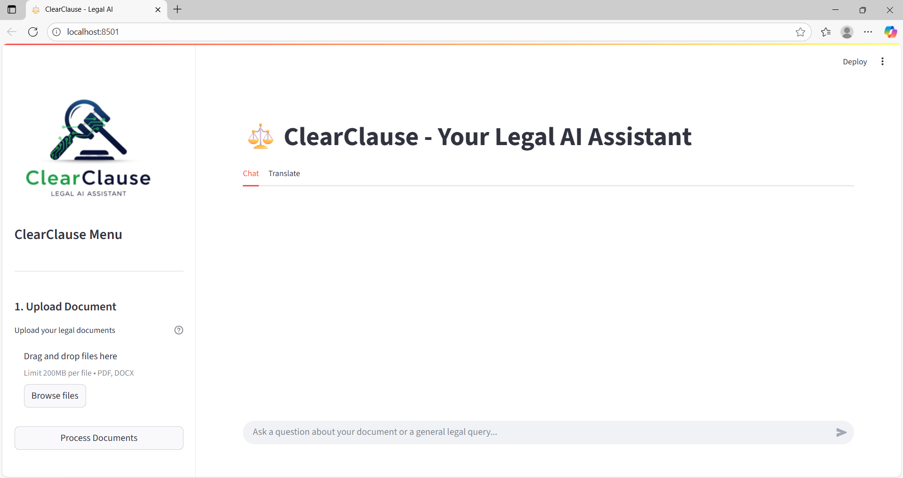
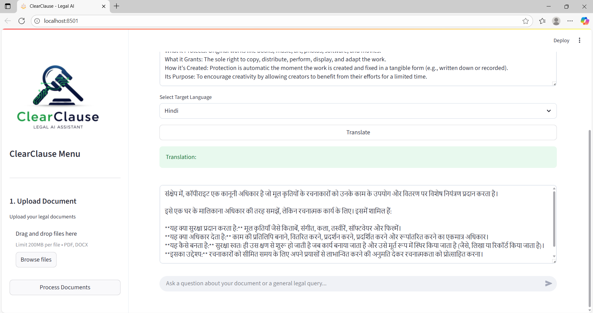
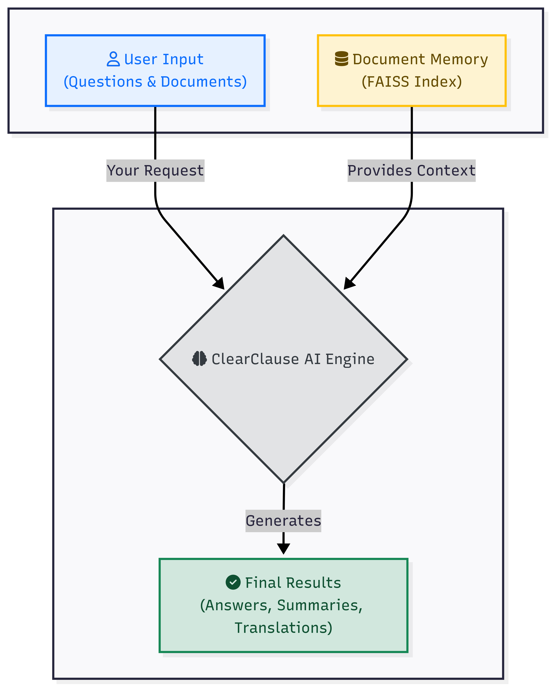

# ⚖️ Lawgic — A Legal AI Assistant

### 🤖 _A Legal AI Chatbot powered by Gemini API_

---

## 📌 Project Overview

**Lawgic** is a Streamlit-based **Legal AI Assistant** designed to help users interact with their legal documents in a more intuitive way.

It allows users to:

- 📑 **Upload and analyze legal documents** (`PDF` / `DOCX`)
- 🤖 **Ask questions** about the uploaded documents or general legal queries
- 📝 **Generate detailed summaries** with **custom instructions**
- 🌍 **Translate text** into multiple languages (currently **Hindi** and **Marathi**)

The system uses **Google’s Gemini 2.5 Flash model** for **QnA, summarization, and translation**, and **FAISS vector database** for efficient semantic search across uploaded documents.

---

## 🛠 Tech Stack

| Category               | Tools/Libraries                                   |
| ---------------------- | ------------------------------------------------- |
| Framework              | Streamlit                                         |
| Language               | Python 3.10+                                      |
| AI Model               | Google Gemini 2.5 Flash via `google-generativeai` |
| Embeddings             | `GoogleGenerativeAIEmbeddings` (LangChain)        |
| Vector Database        | FAISS (Facebook AI Similarity Search)             |
| Text Splitting         | LangChain RecursiveCharacterTextSplitter          |
| Document Parsing       | PyMuPDF (`fitz`), python-docx                     |
| Environment Management | python-dotenv                                     |
| UI Enhancements        | Custom Streamlit CSS styling                      |

---

## 📸 Lawgic Showcase

Here are some visuals of **Lawgic** in action:

| Feature             | Screenshot                                  |
| ------------------- | ------------------------------------------- |
| **Home Page**       |               |
| **QnA Interface**   |       |
| **Document Upload** |     |
| **Summarization**   |  |
| **Translation**     |      |

---

## 🔄 Workflow Explanation

The application's core is a Retrieval-Augmented Generation (RAG) pipeline that can be broken down into three main stages:



1.  📄 **Indexing:** When a `.pdf` or `.docx` is uploaded, its text is extracted, split into intelligent chunks, and converted into a searchable **FAISS vector index**.

2.  🔎 **Retrieval:** For document-specific queries, the system performs a semantic search on the index to find the most relevant text chunks related to the user's prompt.

3.  🤖 **Generation:** The retrieved context (or the direct prompt for general queries) is sent to the **Google Gemini Model**, which generates the final output—whether it's a direct answer, a custom summary, or a translation.

---

## 📊 Key Features

| Feature                  | Description                                                        |
| ------------------------ | ------------------------------------------------------------------ |
| 📂 Multi-Document Upload | Upload one or more `.pdf` or `.docx` legal documents               |
| 🤖 Context-Aware QnA     | Ask questions about your documents or general legal queries        |
| 📝 Custom Summaries      | Generate summaries based on user-defined instructions              |
| 🌍 Multilingual Support  | Translate English legal text into Hindi or Marathi                 |
| 💬 Chat History          | Maintains full interactive conversation logs                       |
| 🎨 Enhanced UI           | Streamlit app with custom **Poppins font** and styled chat bubbles |

---

## 📁 Folder Structure

```
Lawgic—Legal-AI-Assistant/
├── app.py           # Main Streamlit application script
├── requirements.txt # Python libraries required for the project
├── logo.png         # Custom logo for the application UI
├── Outputs/         # Folder containing generated output files
    ├── Home.png
    ├── GeneralQ&A.png
    ├── DocumentQ&A.png
    ├── Summarization.png
    └── Translation.png
├── .gitignore       # Specifies files and folders to be ignored by Git
├── LICENSE          # License file for the project
└── README.md        # Project documentation
```

## 🚀 Getting Started

To get a local copy up and running, follow these simple steps.

### Prerequisites

- **Python 3.10+**
- **Git** version control system
- A **Google Gemini API Key**
  - You can obtain one from [Google AI Studio](https://aistudio.google.com/).

### Installation & Setup

1.  **Clone the Repository**

    ```bash
    git clone https://github.com/sanketjadhav09/Lawgic-Legal-AI-Assistant.git
    cd Lawgic-Legal-AI-Assistant
    ```

2.  **Create and Activate a Virtual Environment**

    - This keeps the project dependencies isolated.

    - **On Windows:**
      ```bash
      python -m venv venv
      .\venv\Scripts\activate
      ```
    - **On macOS/Linux:**
      ```bash
      python3 -m venv venv
      source venv/bin/activate
      ```

3.  **Install Required Libraries**

    ```bash
    pip install -r requirements.txt
    ```

4.  **Set Up the Environment Variable**
    - Create a file named `.env` in the root of the project folder.
    - Add your Google Gemini API key to this file as follows:
      ```
      API_KEY="YOUR_SECRET_API_KEY_HERE"
      ```

---

## 💻 Usage

Once the installation is complete, you can run the application locally with a single command:

```bash
streamlit run app.py
```

Navigate to `http://localhost:8501` in your web browser to interact with the Lawgic Legal AI Assistant.

---

## 🌐 Deployment

This application is designed for and deployed on **Streamlit Community Cloud**. The deployment process is automated via GitHub:

1.  A public GitHub repository holds the application code (`app.py`, `requirements.txt`, etc.).
2.  The `.env` file containing the `API_KEY` is kept local and ignored by Git via `.gitignore`.
3.  The API key is securely stored in the Streamlit Cloud application's **Secrets management**.
4.  Any push to the `main` branch on GitHub automatically triggers a redeployment of the application.

**Live App URL:** [**https://lawgic-legal-ai-assistant.streamlit.app/**](https://lawgic-legal-ai-assistant.streamlit.app/)


